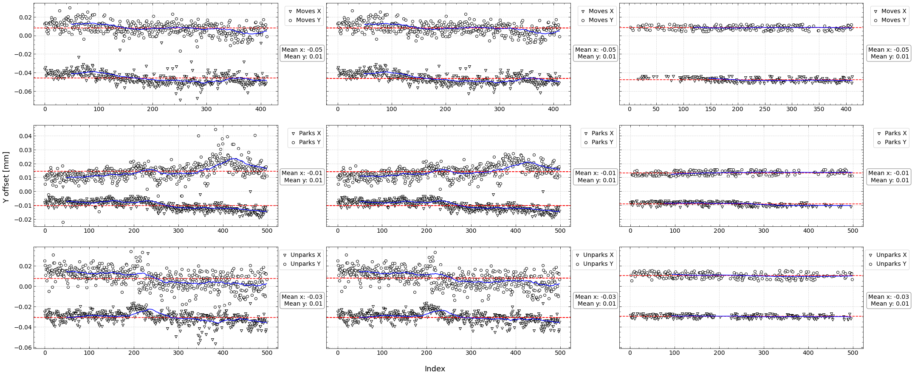
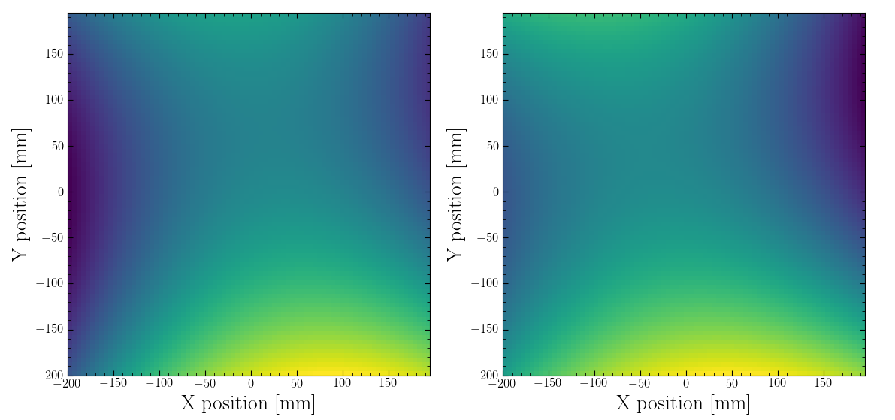
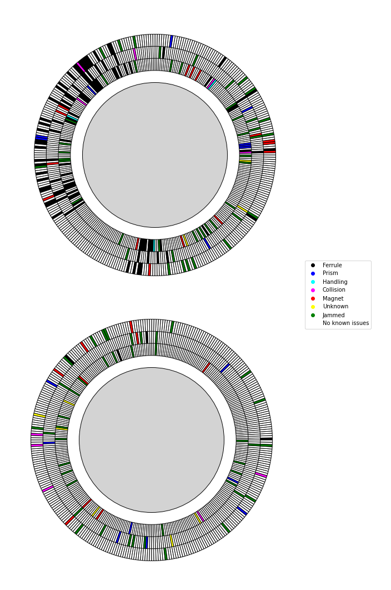
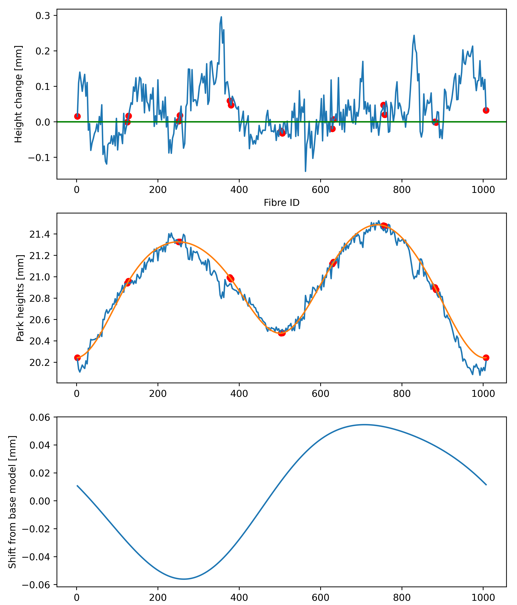

# Data-Visualisation

This repository is designed to highlight examples of the data visualisations that I have created throughout my career. Many of these examples are from my PhD thesis and include:
- Sigma clipping of data extracted from my calibration database
- Least squares fitting over a 2D to create surface maps
- Spline fitting of data and residual plotting
- Vector diagrams displaying instrument concepts

Each of these examples has been created with Python using packages such as Matplotlib, Seaborn, and Scikit-learn amongst others.

There is also a folder containing posters I created and presented at the SPIE Astronomical Telescopes and Instrumentation 2022 conference, as well as the REU Undergraduate placement poster session in 2018.

---

## Sigma Clipping

The plot below displays the corrective movement data recorded for a single optical fibre being placed multiple times by a positioning robot. Each row represents a type of movement, either a movement from one coordinate to another, a movement from a coordinate to its park position, or a movement from its park position to a coordinate.

From left to right the panels represent the number of sigma clipping iterations applied to the display its impact on the number of data points excluded by the process, as well as the mean offset.

This plot was designed to investigate the filtering level needed for new data to prevent extreme values from skewing the corrective offset applied to each movement over time.

Please see my Calibration Database repository for the source code used to generate the data for these plots.

---
## Least Squares Fitting

I created the plot below to create a map of the field plate height where optical fibres were being placed. Each map is unique to the positioning robot used to measure the height. These maps were produced by completing a least squares fit across a regular grid of points after a series of height measurements were taken using each positioning robot. The left and right-hand sides represent one of the two robots.

## Positioner fibre visualisation
---
The plot below shows the exact location of the disabled fibres for each side of the WEAVE fibre positioner, coloured according to the reason for their failure.
This information is crucial for both the astronomers as they plan their surveys and the engineering team responsible for repairing and maintaining the fibre's themselves.

## Residual fitting
---
To verify our model predictions of the WEAVE fibre positioner, park height measurements were taken across a fixed set of accessible coordinates for the complete set of orientations. Below is a visualisation of how our predictive model compares with the measurements taken for a single orientation.

(Middle) A plot of the predicted park heights represented by the blue line, with the measured coordinates displayed as red points. The orange line represents a simple spline fit to the points over the range of the predicted heights for a smooth comparison.

(Top) A plot of the residuals of the spline fit and the predicted park heights, shown by the blue line. Here the red points represent the residuals between the measurecoordinates and the spline fit with the zero point emphasised by the green line.

(Bottom) The difference between the predictive map at a particular orientation and the base model prediction in the 'neutral' orientation. This plot depicts the change in the extrapolated plate map between positioner orientations.

